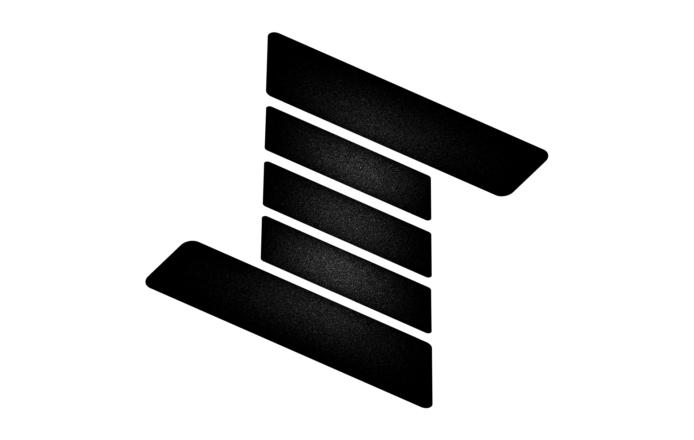

  

    <i>Generate expressive drum grooves</i>
     
     
    
    

  <a href="https://koil.re/regroove">Home</a>
  -
  <a href="https://koil.re/docs/regroove">Documentation</a>

 

This repository contains code used by the `regroove-m4l` Max for Live patch. The code in this package is responsible for running ONNX model inference, handling tensors (which is a notorious PITA in JavaScript), and other utility methods used by the applications. This code is specifically implemented as a standalone NPM package to allow for bug fixes and ONNX model updates without having to ship a new patch. 

regroove generates drum grooves using a low-dimensional representation of drum rhythms learned using a VAE architecture with an RNN encoder and decoder. Based on a user input drum pattern, the algorithm generates variations of this pattern and allows the user to exercise stylistic control over the generated patterns. Stylistic control includes syncopation density, note velocity and dynamics, and note microtiming.

